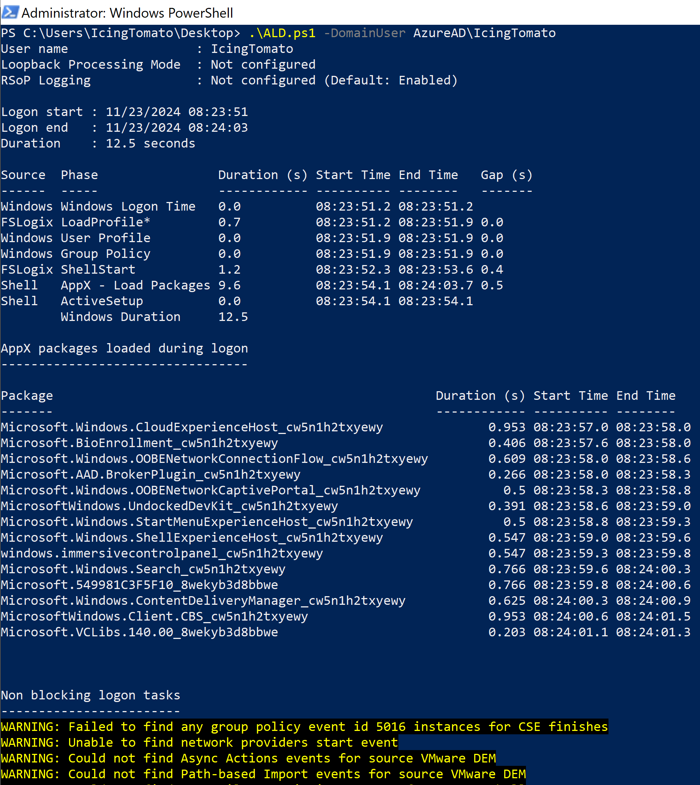

# Analysis Logon Duration

This is a PowerShell script for checking the logon duration of VDI(Windows Virtual Desktop/Citrix/VMWare Horizon) users. 

## Usage/Syntax

```powershell
.\ALD.ps1 -DomainUser ICING\tomato
# Gets analysis of the logon process for the user 'tomato' in the current domain.

.\ALD.ps1 -DomainUser AzureAD\tomato
# Gets analysis of the logon process for the user 'tomato' in the AAD joined machine.

#The temp file will be saved in C:\Windows\Temp\ALD\*.txt
```

## Output 

The script will output the following information:



## Acknowledgement

[@TrententTye](https://x.com/TrententTye) - For the inspiration and guidance.
